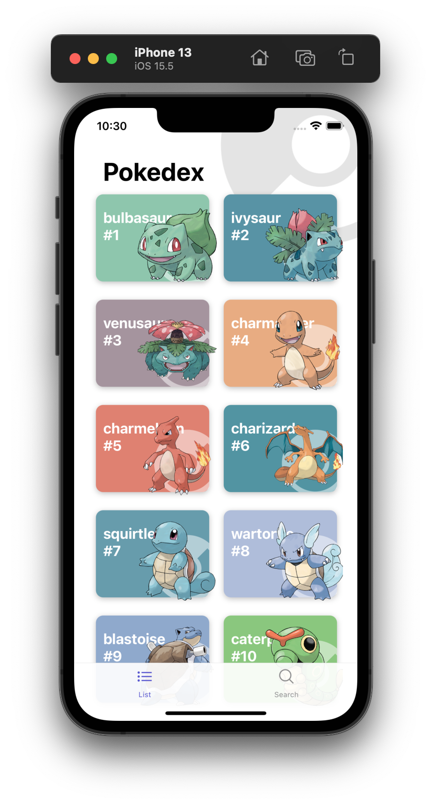
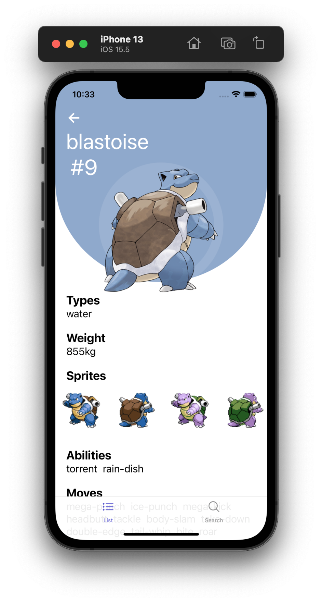
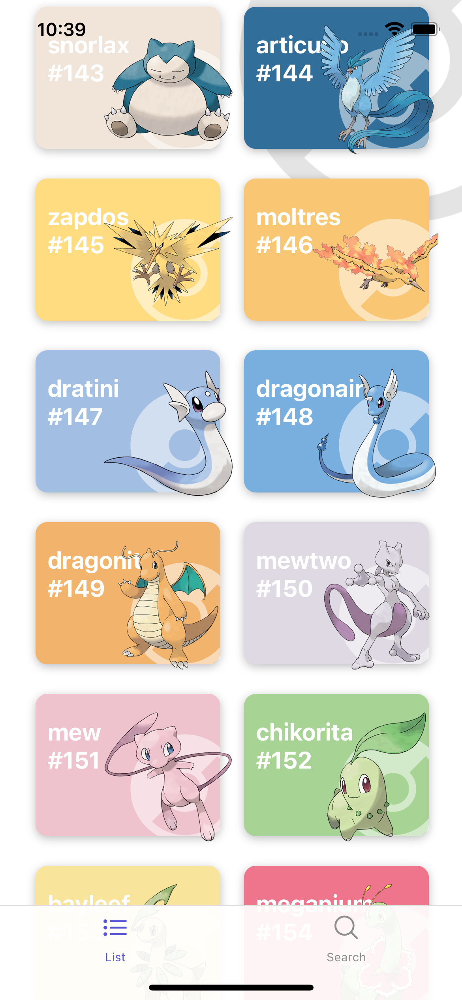
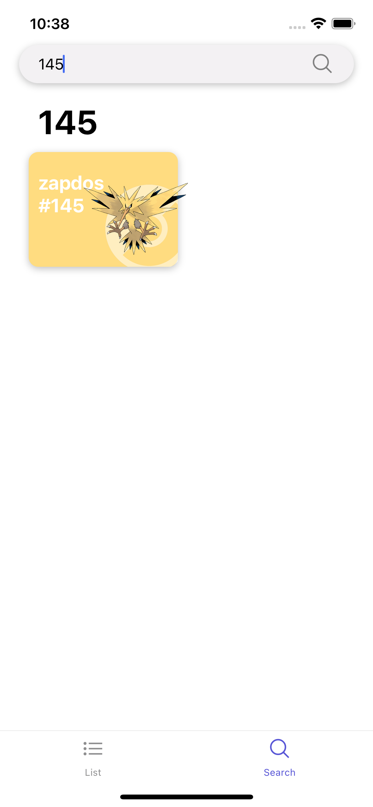
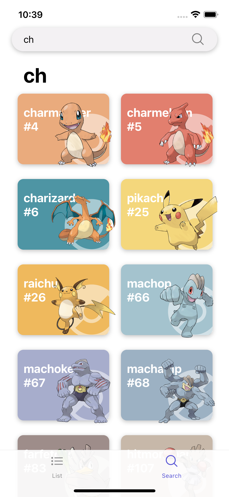
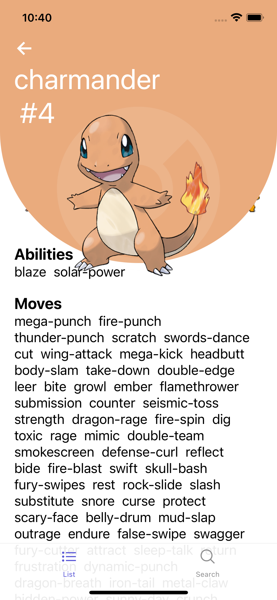

# Franklin Movies App

Consuming the Poke API.

React Native Crossplatform Movile App.

Technologies and Features:

* TypeScript
* Custom Hooks
* React Hooks useState & useEffect
* React Native Animation
* Stack Navigation
* Typed navigation params.
* Bottom Tabs Navigation
* Build Custom Debounce Search Bar using timeOuts.
* Infinite Scroll while consuming Poke API.
* Extract colors from images.

## Screenshots

