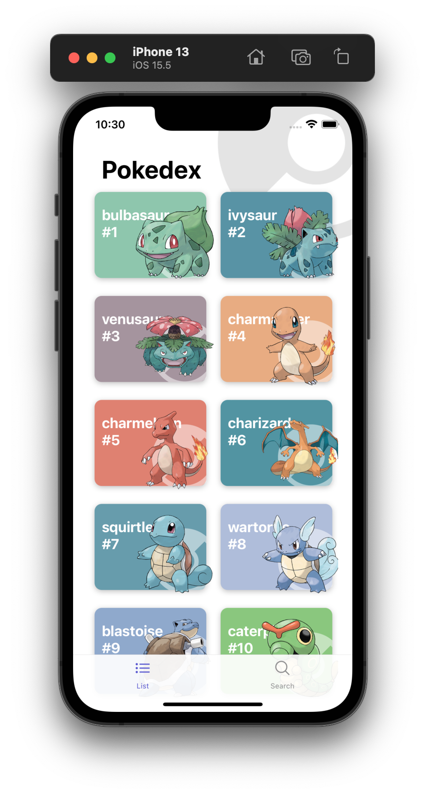
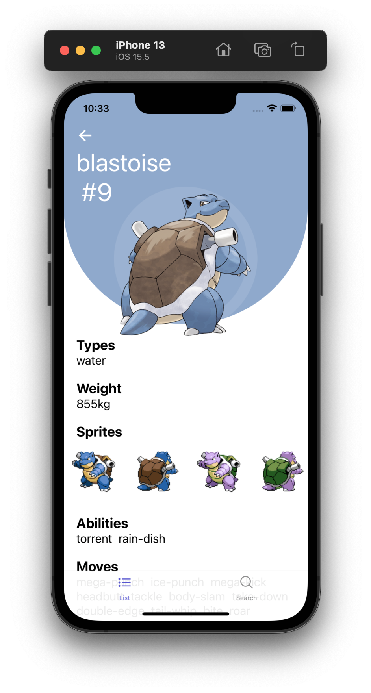
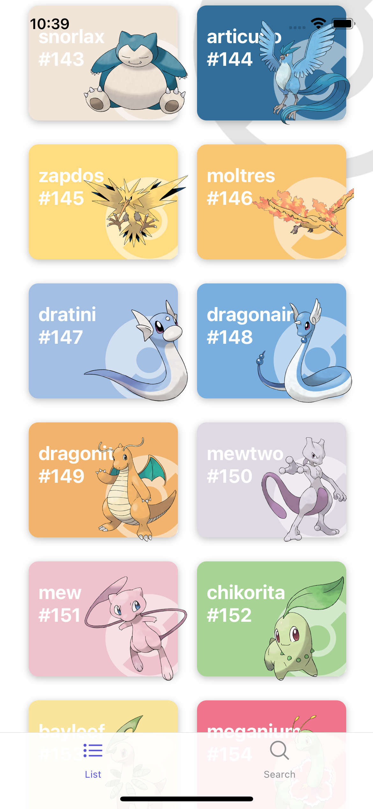
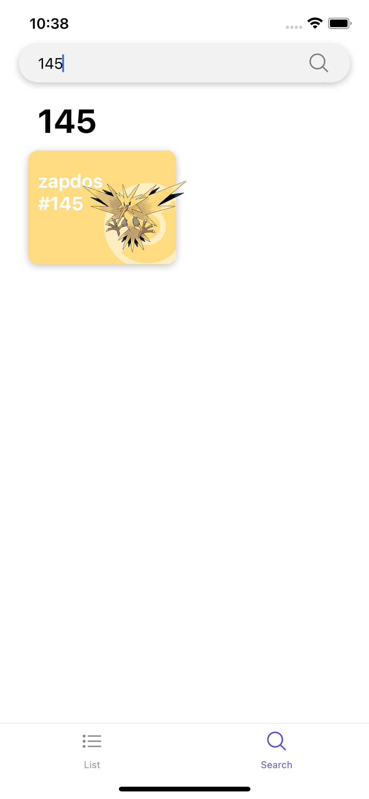
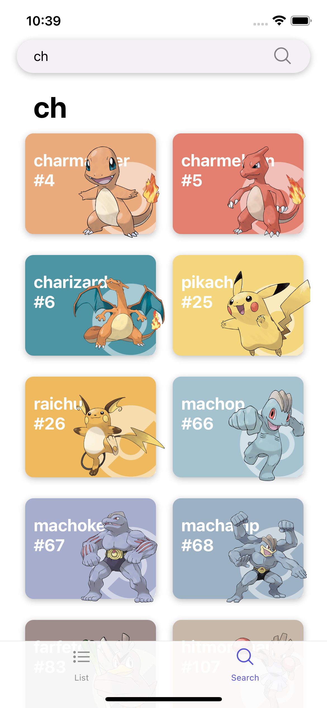
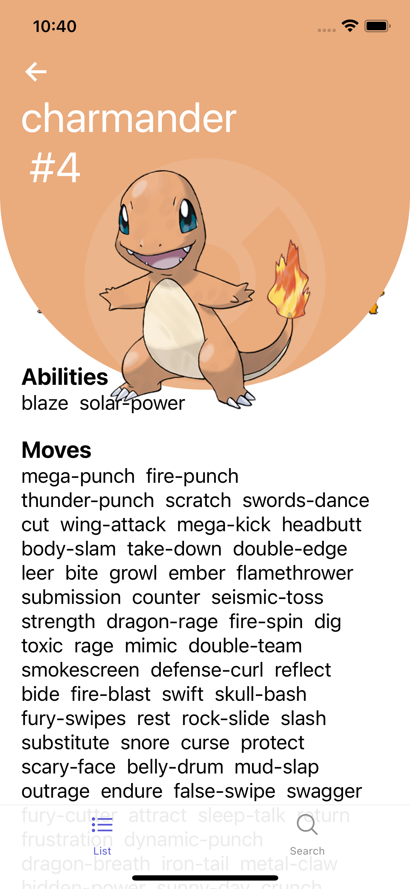

# Pokedex - React Native

A cross-platform mobile app built with React Native and TypeScript that consumes the [PokeAPI](https://pokeapi.co/).

## Features

- **Infinite Scroll** — Paginated Pokemon list using FlatList with cursor-based API pagination
- **Debounced Search** — Search by name or ID with a custom debounce hook to avoid excessive filtering
- **Dynamic Color Theming** — Extracts dominant colors from Pokemon images to theme each card and detail screen
- **Smooth Animations** — Fade-in image loading and position transitions using the native driver
- **Type-Safe Navigation** — Stack and Bottom Tab navigators with fully typed route params

## Tech Stack

| Category   | Technology                             |
| ---------- | -------------------------------------- |
| Framework  | React Native                           |
| Language   | TypeScript                             |
| Navigation | React Navigation (Stack + Bottom Tabs) |
| HTTP       | Axios with centralized API config      |
| Config     | react-native-config (.env)             |

## Architecture

```
src/
├── api/           # Axios instance + env config
├── components/    # Reusable UI (PokemonCard, FadeInImage, SearchInput...)
├── hooks/         # Custom hooks (pagination, search, debounce, animation)
├── interfaces/    # TypeScript type definitions
├── navigator/     # Tab and Stack navigators
├── screens/       # HomeScreen, SearchScreen, PokemonScreen
└── theme/         # Centralized styles
```

**Key patterns:**

- Business logic lives in custom hooks — screens stay thin
- `useRef` for pagination state to avoid unnecessary re-renders
- `isMounted` ref pattern to prevent state updates on unmounted components in FlatList
- Platform-specific styling for iOS and Android
- Environment variables via `react-native-config` — no hardcoded URLs
- Memory leak prevention in list items using `useRef` mounted checks
- Responsive grid layout adapting to screen width via `Dimensions` API

## Setup

```bash
# Install dependencies
nvm use 20
npm install

# Create env file
cp .env.example .env

# iOS
cd ios && pod install && cd ..
npx react-native run-ios

# Android
npx react-native run-android
```

## Screenshots

<p align="center">


</p>

<p align="center">

</p>

<p align="center">


</p>

<p align="center">


</p>

<p align="center">


</p>
